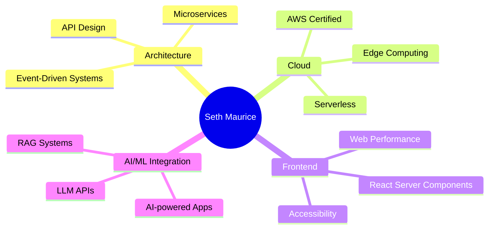

<div align="center">

<!-- Typing SVG -->
[](https://git.io/typing-svg)

<!-- Profile Views & Followers -->

[](https://github.com/Sethmaurice)

</div>

---

## 🧑‍💻 About Me

```yaml
name       : Seth Maurice Grevisse
location   : Kigali, Rwanda 🇷🇼
role       : Full Stack Developer & Software Architect
experience : Building production-grade, scalable web systems
focus      :
  - Cloud-native applications
  - API design & microservices
  - System design & architecture
  - Developer experience & tooling
currently  : Open to exciting projects & collaboration
contact    :
  email     : sethmaurice1@gmail.com
  phone     : +250 781 108 346
  whatsapp  : +250 781 108 346
fun_fact   : "Great code is written for humans first, machines second."
```

---

## 🌆 My GitCity

<div align="center">

> 🏙️ **[Visit My GitCity →](https://www.thegitcity.com/?user=sethmaurice)**

</div>

---

## 🛠️ Tech Stack

### 🧑‍💻 Languages


### 🚀 Frameworks & Libraries

**Frontend**


**Backend**


**Testing**


### ☁️ Databases & Cloud

**Databases**


**Cloud & Infrastructure**


### 🔧 Tools & DevOps

**Containers & CI/CD**


**Dev Tools**


**Monitoring & Observability**


---

## 📊 GitHub Stats

<div align="center">


</div>

<div align="center">

[](https://git.io/streak-stats)

</div>

---

## 📈 Contribution Activity

[](https://github.com/ashutosh00710/github-readme-activity-graph)

---

## 🧠 What I'm Currently Focused On



---

## 🌍 Open Source & Community

- 🤝 Open to **collaborating** on meaningful open source projects
- 🧩 I love **reviewing PRs** and helping juniors grow
- 📝 I occasionally write about **architecture & engineering best practices**
- 🎓 Passionate about **developer education** in Africa

---

## 📬 Connect With Me

<div align="center">

[](https://www.linkedin.com/in/sethonde-maurice-23a50a265/)
[](https://sethmauricegrevisse.vercel.app/)
[](mailto:sethmaurice1@gmail.com)
[](https://wa.me/250781108346)
[](tel:+250781108346)
[](https://www.thegitcity.com/?user=sethmaurice)

</div>

---

## 💡 Today's Dev Wisdom

<div align="center">

[](https://github.com/piyushsuthar/github-readme-quotes)

</div>

---

<div align="center">

**Thanks for stopping by! Drop a ⭐ on something you find useful 🙏**

*— Seth Maurice, building from Kigali 🇷🇼 to the world 🌍*


</div>
